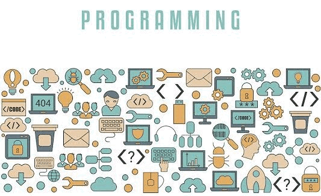

<p align="center">
  
</p>


<!--


-->


```
[
 {
  "id" : 1,
  "Name": "Gautam Hirawat",
  "Pronouns":  "He | Him",
  "Hobbies / Love": ["music", "Novel"],
  "IDE": ["Vs Code", "Android Studio"],
  "Os":  ["Ubuntu" , "mint" , "windows11"],
  "Current focus": "leetcode",
  "Plan to learn": ["Javascript", "NodeJs", "Flutter"],
  "Currently Working" : "https://github.com/Gautamhirawat/Web-Devlopment/tree/main/Web_Sites/News_Websites",
  "Moto": "You can do it by practicing it again and again and again",
  "connect with me": {
  "telegram": "https://t.ms/Gautamhirawat",
  "email": "code.gautamhirawat@gmail.com",
  "linkedin": "https://www.linkedin.com/in/gautamhirawat",
  }
 }
]
```


## 👨‍💻 &nbsp;Talking to Computers Using :

### &nbsp;- Languages

&nbsp;&nbsp;&nbsp; &nbsp;
&nbsp;

### &nbsp;- Libraries, Frameworks, Tools  

&nbsp;
&nbsp;&nbsp;  &nbsp;&nbsp;
 
 

### &nbsp;- Plan to learn  


&nbsp;
&nbsp;&nbsp;  &nbsp;&nbsp;
 
 


<!-- 

NOTE : Make seprate project don't make bundle 
## Projects 💻

[](https://github.com/Gautamhirawat/LEARN_EVERY_WEEK)
[](https://github.com/Gautamhirawat/PYTHON-Projects)
[](https://github.com/Gautamhirawat/JAVA-Projects)
[](https://github.com/Gautamhirawat/Web-Devlopment)


## Currently working on 💻
[](https://github.com/Gautamhirawat/Web-Devlopment)

<p align="left"><a href="https://github.com/Gautamhirawat/Web-Devlopment/tree/main/Web_Sites/News_Websites"></a></p>

-->

<!--
If done something good them show them as well:-(
[](https://github.com/Gautamhirawat/PYTHON-LEARN)
[](https://github.com/Gautamhirawat/JAVA-language)
[](https://github.com/Gautamhirawat/Cpp-LEARN)
 -->


```
@@ @ @ @ @ @ @ @ @ @ @ @ @ @ @ @ @ @ @ @ @ @ @ @ @ @ @ @@
@@       o o                                           @@
@@       | |                                           @@
@@      _L_L_                                          @@
@@   ❮\/__-__\/❯  Any fool can write code that a       @@
@@   ❮(|~o.o~|)❯     computer can understand.          @@
@@   ❮/ \`-'/ \❯  Good programmers write code that     @@ 
@@     _/`U'\_        humans can understand            @@                    
@@    ( .   . )     .----------------------------.     @@
@@   / /     \ \    |       Martin Fowler        |     @@
@@   \ |  ,  | /    '----------------------------'     @@
@@    \|=====|/                                        @@
@@     |_.^._|                                         @@
@@     | |"| |                                         @@
@@     ( ) ( )   Testing leads to failure              @@
@@     |_| |_|   and failure leads to understanding    @@
@@ _.-' _j L_ '-._                                     @@
@@(___.'     '.___)                                    @@
@@ @ @ @ @ @ @ @ @ @ @ @ @ @ @ @ @ @ @ @ @ @ @ @ @ @ @ @@
```


## Spotify Playing 🎧

[](https://open.spotify.com/user/316pkmdg4ezqid57jernjlbsqh3a)


<p align="right"><a href="#top"></a></p>


<!--


For Stats
<p align="center">

</p>

<p align="center">
    
</p>

For trophies 
[](https://github.com/ryo-ma/github-profile-trophy)
For Visit Count 
[](https://visitcount.itsvg.in)


<details>
<summary>Github stats</summary>

[](https://www.github.com/Gautamhirawat)[](https://github.com/ryo-ma/github-profile-trophy)

</details>


-->


